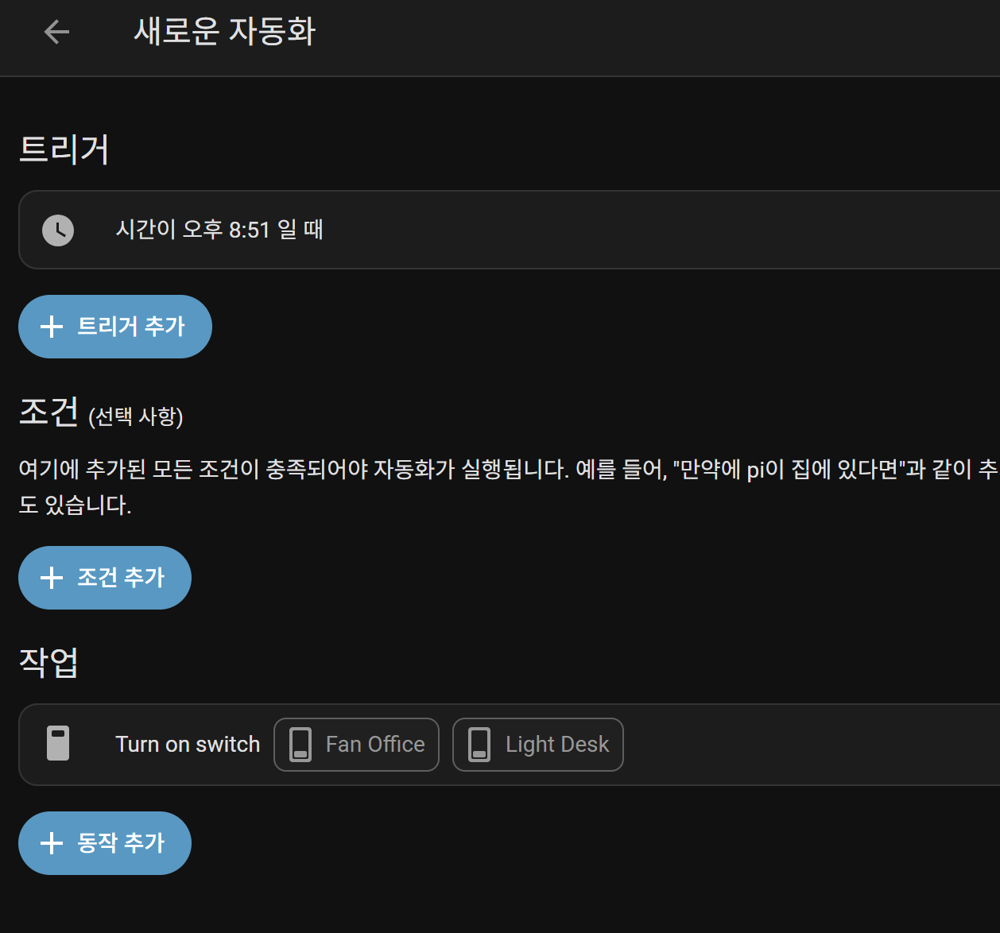
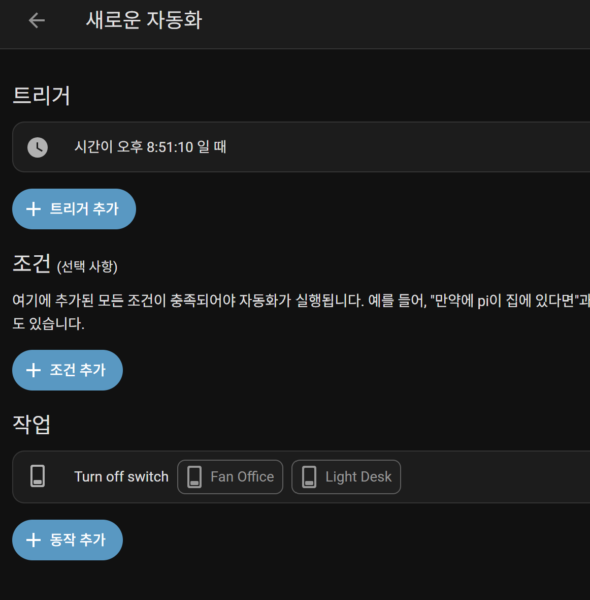

# IoT26-HW05: Getting Started with Home Assistant on Raspberry Pi

## 1. Project Overview

This assignment focuses on setting up Home Assistant on Raspberry Pi and building a simple home automation example. Using the `rpi_gpio` integration, I configured two GPIO-controlled switches (Fan Office on GPIO 11, Light Desk on GPIO 12) and created a time-based automation that automatically turns them on and off through the Home Assistant dashboard.

## 2. Execution Screenshots

Below are screenshots of the Home Assistant dashboard showing the switch states.

**Turn On:**



**Turn Off:**



## 3. Working Video

GIF Preview:


## 4. Main Configuration

**configuration.yaml** — GPIO switch setup:

```yaml
switch:
  - platform: rpi_gpio
    switches:
      - name: Fan Office
        port: 11
      - name: Light Desk
        port: 12
```

**automations.yaml** — Time-based automation:

```yaml
- id: '1779552012896'
  alias: 새로운 자동화
  triggers:
    - trigger: time
      at: '20:51:00'
  actions:
    - action: switch.turn_on
      target:
        entity_id:
          - switch.fan_office
          - switch.light_desk

- id: '1779552104183'
  alias: 새로운 자동화
  triggers:
    - trigger: time
      at: '20:51:10'
  actions:
    - action: switch.turn_off
      target:
        entity_id:
          - switch.fan_office
          - switch.light_desk
```
